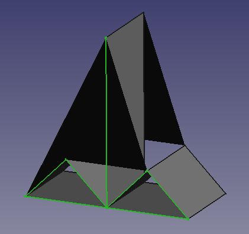

# explore-ai-blog

This repo aims to over time describe some small tests that aim to show the limits of publicly available AI and how those limits progress over time. The explored tasks will for now focus on programming related challenges and CAD related challenges.

**[2022-12-31-tsp-in-prolog-with-chatGPT-3](2022-12-31-tsp-in-prolog-with-chatGPT-3.md)**

The first test examined chat-gpt-3:s capability to handle prolog. Prolog was chosen since it's different from most other programming language and it's not a common language to use. Handling pyton is one thing, but handling prolog is even more impressive.

**[2023-01-30-translate-numbers-to-danish](2023-01-30-translate-numbers-to-danish.md)**

A common programming task for beginners in Sweden is to build a program that translate Danish numbers into Swedish or English. The number system in Danmark was not explained, instead it tested if  chat-gpt-3 had it's own knowledge about the Danish number system that it could use to create the translation program.

**[2023-02-19-create-a-simple-web-page](2023-02-19-createa-a-simple-web-page.md)**

A real usable task would be if you could have a conversation an from that create the a good looking and efficient webpage. If it's possible it would open up the possibility to edit webpages for a lot more people who has knowledge to share, but not the skills to create a webpage (or a template for a CMS).

**[2023-03-18-chat-gpt-as-your-editor](2023-03-18-chat-gpt-as-your-editor.md)**

Having chat-gpt as your editor that reads the text that you have written turned out to be very useful. For a non native English speaker, it's really helpful to be aware of some of the less obvious mistakes when writing. However, I'm in no doubt that there are a lot of misstages in this blog that neither I nor chat-gpt finds.

**[2023-10-30-help-me-create-a-2-dimensional-fish](2023-10-30-help-me-create-a-3-dimensional-fish.md)**

The first test where CAD was used. The first task was to outlining a fish and give it a pad.

I think chat-gpt may have used it's more artistic side when helping out with this task.

**[2023-12-11-solving-a-simple-code-challange-with-prolog](2023-12-11-solving-a-simple-code-challange-with-prolog.md)**

Another challenge using prolog. How can chat-gpt help me solve a simple programming problem when I use a language that I don't really master.
